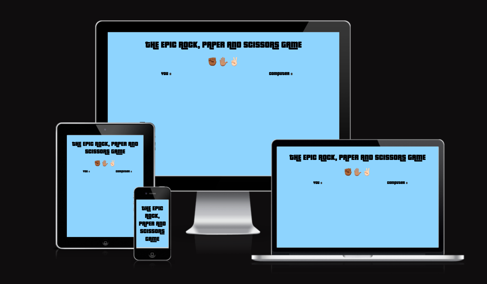
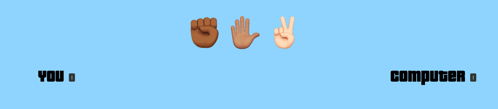
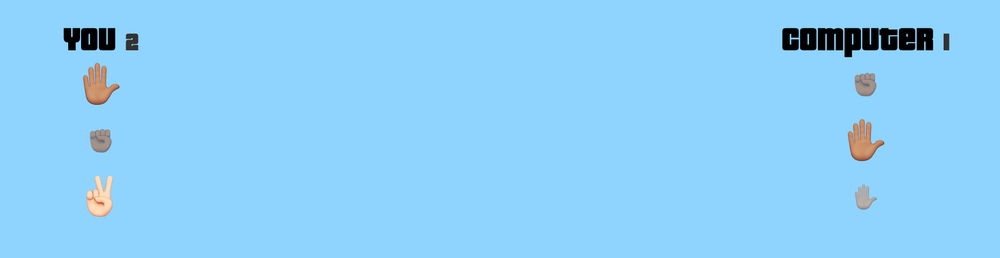

# ROCK PAPER SCISSORS
Welcome to my rock, paper and scissors game. Here you can play rock, paper and scissors against the computer. A really fun and hard game to practice your rock, paper and scissors skills. Enjoy!

# Feature
## Existing Features
* ### Title
    * Responsive title who welcomes the player to the game
    

* ### The game area
    * Here you can choose between rock, paper or scissors. Hover over the icons and click to see the result. 
    * There is also a score counter at the side of you and the computer. 

* ### The result page
    * Here you can see the results after every click.
    * If you lose, the opacity of the icon is different than the winning icon.
    * If you win, the icon will be bigger and no opacity.

# Testing
I've been testing a lot with different sizes of pixels, percentage and more to make the screen fit all devices. I had a tough time but managed in the end to make it work by testing. 

* ### HTML
    * No errors were returned when passing through the official W3C validator

 * ### CSS
    * No errors were returned when passing through the official (Jigsaw) validator
* ### Javascript
    * No errors were returned when passing through the official (Jshint) validator

# Unfixed bugs
    * I havent found any bugs yet. 

# Deployment
* ### The site was deployed to GitHub pages. The steps to deploy are as follows:
    * In the GitHub repository, navigate to the Settings tab.
    * From the source section drop-down menu, select the Main Branch.
    * Once the master branch has been selected, the page will be automatically refreshed with a detailed ribbon display to indicate the successful deployment.

The live link can be found here - https://philipn778.github.io/Project2-Rock-paper-scissor/

# Credits

* ### Content
    * I coded the template from https://www.youtube.com/watch?v=1yS-JV4fWqY

* ### Media
    * All the images on the site is taken by myself or made by myself.

All code is written by me. 